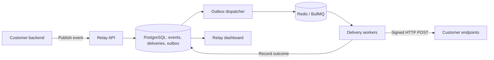

# Relay

Relay is a webhook delivery platform. Your backend publishes an event once; Relay sends it to subscribed HTTP endpoints, retries temporary failures, and keeps a history of every delivery attempt.

The dashboard lets you manage endpoints and credentials, inspect payloads and responses, and replay deliveries after fixing a problem. Endpoint circuit breakers pause unhealthy receivers, a failure inbox supports tracked bulk replay, and tenant-aware scheduling bounds each workspace's queued work. Workspace tools include delivery alerts, signed test webhooks, scoped API keys, and configurable retention. The API, dispatcher, and delivery workers run as separate processes, with PostgreSQL as the durable store and Redis/BullMQ for background work.

## Run locally

Requirements: Node.js 24+, pnpm 11.19.0, and Docker Desktop or Docker Engine. The pnpm version is pinned in `package.json`.

```sh
pnpm install
pnpm setup
docker compose up --build -d
```

`pnpm setup` creates an ignored `.env` with a random encryption key and demo password. Sign in using `SEED_EMAIL` and `SEED_PASSWORD` from that file, or register a new account. Setup and seeding preserve existing accounts and configuration.

| Service              | URL                          |
| -------------------- | ---------------------------- |
| Dashboard            | http://localhost:3000        |
| API health           | http://localhost:4000/health |
| OpenAPI reference    | http://localhost:4000/docs   |
| Grafana              | http://localhost:3001        |
| Prometheus           | http://localhost:9090        |
| Jaeger               | http://localhost:16686       |
| Test receiver health | http://localhost:4200/health |

Grafana's local credentials are `admin` / `relay-local-dashboard`. Set `GRAFANA_PASSWORD` in `.env` to change the password. These defaults are for local development; exposed service ports bind to loopback.

### Run the application outside Docker

For development, run PostgreSQL, Redis, and the test receiver in containers, and the application processes on your machine:

```sh
pnpm infra
pnpm db:generate
pnpm db:migrate
pnpm db:seed
pnpm dev
```

Stop the containerized API, dispatcher, worker, and web app first if they are running; both modes use the same application ports. This development command does not start the monitoring containers.

Demo endpoint URLs use `http://receiver:4200` in full Docker mode and `http://localhost:4200` in host development mode. Rerun seeding when switching modes. It updates recognized demo receiver URLs while preserving their enabled state. Update any custom development endpoints yourself.

## Stack

| Area                         | Tools                                                                        |
| ---------------------------- | ---------------------------------------------------------------------------- |
| Dashboard                    | Next.js, React, TypeScript, Tailwind CSS, TanStack Query, Radix UI, Recharts |
| API and background processes | NestJS, TypeScript                                                           |
| Database                     | PostgreSQL, Prisma                                                           |
| Queue and shared limits      | Redis, BullMQ, Lua token buckets                                             |
| Observability                | Pino, OpenTelemetry, Prometheus, Grafana, Jaeger                             |
| Testing                      | Jest, Testcontainers, Playwright, k6                                         |
| Local environment and CI     | Docker Compose, pnpm workspaces, GitHub Actions                              |

## How someone uses Relay

Consider an ecommerce team that wants to notify inventory, shipping, and analytics services whenever an order is created. The developer configures Relay; shoppers continue using the ecommerce application.

There are three parts to this integration:

- **Producer:** the team's backend, which publishes events to Relay.
- **Relay:** stores events and manages delivery.
- **Receiver:** an HTTP endpoint that verifies and processes incoming webhooks.

### 1. Create an account and workspace

The developer registers with their name, email, password, and workspace name, such as `Acme Store`. Relay creates the workspace and makes them its owner.

A new workspace starts empty. Its endpoints, events, deliveries, credentials, and audit records are isolated from other workspaces. Users can create additional workspaces and switch between those they belong to.

The dashboard has views for the overview, events, failure inbox, endpoints, alerts, testing, retention settings, API keys, team, audit log, and documentation.

### 2. Add receiving endpoints

The developer opens **Endpoints** and adds an endpoint with a name, URL, and event subscriptions:

| Endpoint  | Example URL                              | Subscriptions                      |
| --------- | ---------------------------------------- | ---------------------------------- |
| Inventory | `https://inventory.example.com/webhooks` | `order.created`, `order.cancelled` |
| Shipping  | `https://shipping.example.com/webhooks`  | `order.created`                    |
| Analytics | `https://analytics.example.com/webhooks` | All events                         |

These endpoints must already exist in the receiving services. The developer writes their request handlers; Relay does not create them or implement their business logic.

An empty subscription list means all event types. When Relay accepts an event, it selects currently enabled endpoints with matching subscriptions and creates a separate delivery for each one.

An event with no matching endpoints is still stored, but has no deliveries. Adding an endpoint later does not automatically send it earlier events.

### 3. Configure signature verification

Relay generates a signing secret when an endpoint is created and displays it once. The developer stores it in the receiving service's configuration.

The receiver should verify the signature and timestamp, check for duplicate event IDs, durably store or enqueue the event, and return a `2xx` response. It can then perform the business operation, such as updating inventory.

Delivery is **at least once**. A receiver may process a request even if its response is lost or a worker crashes before recording success. Deduplicate by `webhook-id` to avoid repeating business actions. See the [delivery contract](#delivery-contract) for the exact signature format.

### 4. Create a publishing API key

The owner creates a named key under **API keys** and copies its value, which is shown once. The key belongs in the producer backend's secret configuration, never in frontend code.

Choose the minimum permissions the integration needs. Publishing keys use `events:publish`; separate keys can read events or endpoints, replay deliveries, or run webhook tests. Optionally restrict which event types a key may publish and give it an expiry. Existing keys remain publish-only. Keys cannot administer workspace settings, alert rules, or credentials. Rotation revokes the old key immediately and preserves its permissions, event-type restrictions, and expiry, so update the producer with the replacement.

### 5. Send a test event

Before connecting real traffic, open **Testing**, choose one enabled endpoint, and select a sample order, subscription, or report payload. A test targets only that endpoint, even when its subscriptions differ. Tests send real HTTP requests with `webhook-test: true`; the receiving service should recognize that header and avoid business side effects. Normal signing, retries, circuit breakers, and quotas still apply.

The testing view shows status, response previews, duration, outgoing headers, and the exact request body. Its signature verifier checks the captured body, timestamp, and signatures against the endpoint's current secret and valid previous secret. Test traffic is excluded from the production overview and delivery-alert evaluation.

Use **Publish event** when checking ordinary subscription routing. Provide an event type, an idempotency key, and a JSON payload:

```json
{
  "type": "order.created",
  "payload": {
    "orderId": "ord_123",
    "amount": 2499,
    "currency": "INR"
  }
}
```

For this event, an idempotency key could be `order-ord_123-created`.

The event appears in **Events**, where the developer can inspect its payload and each endpoint's delivery attempts. This checks the endpoint URL, subscriptions, signature verification, and receiver response before integrating the producer.

### 6. Connect the producer backend

After saving an order, the producer calls Relay's API:

```sh
curl http://localhost:4000/events \
  -H 'Authorization: Bearer YOUR_API_KEY' \
  -H 'Idempotency-Key: order-ord_123-created' \
  -H 'Content-Type: application/json' \
  -d '{"type":"order.created","payload":{"orderId":"ord_123","amount":2499,"currency":"INR"}}'
```

Relay only knows about events the producer publishes. It does not automatically detect orders or connect to an ecommerce provider.

If the producer loses the API response, it can retry the same request with the same idempotency key. Within that workspace, Relay returns the original event instead of creating another one. Reusing the key with different contents returns `409`. An event removed by retention returns `410` on a matching retry; a small receipt prevents republishing it. The current fingerprint uses the parsed JSON's serialized field order, so preserve the request structure when retrying.

### 7. Relay accepts and dispatches the event

The API validates authentication, the payload, and the publishing quota. It saves the event, matching deliveries, outbox records, and an audit entry in one PostgreSQL transaction, then returns the event and delivery records.

**Acceptance means the event is stored, not that its destinations have received it.** Delivery happens asynchronously:



The dispatcher queues saved outbox work. Workers claim deliveries, apply workspace rate and concurrency limits, sign requests, and send them to receivers. Every HTTP attempt records its status, duration, response preview, and any error.

Each destination progresses independently. A shipping failure does not prevent inventory and analytics from receiving their deliveries.

### 8. Inspect outcomes and recover failures

The Events view supports search, status filters, pagination, payload inspection, and per-delivery attempt history. Status updates arrive through SSE, with polling as a fallback.

Suppose inventory and analytics return `200`, but shipping returns `503`. Relay marks the first two deliveries successful and schedules another shipping attempt. If shipping recovers, that attempt can complete automatically.

Once a delivery is terminal, the developer can replay it after fixing the receiver. The endpoint must be enabled. Replay starts a new delivery generation with a fresh retry budget and age limit, preserves previous attempts, and keeps the same event ID. It applies to the selected delivery, not every destination. Receivers must deduplicate replays too.

For multiple failures, open **Failure inbox**, filter by event type or endpoint, select deliveries, and start a replay batch. Batches accept up to 500 failed deliveries and show queued, requeued, skipped, and current delivery outcomes. A completed batch has finished scheduling; its HTTP deliveries may still be running. Disabled endpoints or deliveries changed since submission are skipped with a reason.

Endpoint cards show **closed**, **open**, or **half-open** circuit state. Repeated transient failures open the circuit and pause deliveries without spending HTTP attempts. After a cooldown, one delivery probes the receiver. Owners can request **Probe now** after fixing the service. Paused deliveries still have a maximum age.

A `2xx` response confirms that the receiver acknowledged the webhook. It does not prove that downstream work, such as shipping an order, completed.

### 9. Operate the integration

After setup, the producer publishes events and Relay delivers them without dashboard interaction. The team returns to investigate failures, change subscriptions, rotate credentials, or add endpoints.

Owners manage endpoints, API keys, and invitations. Members can inspect events, publish events, and replay deliveries. Invitations generate shareable links, bind to the invited email, and expire after seven days; invitation emails are not sent.

Signing-secret rotation includes a 24-hour overlap with the previous secret. Owners can also disable endpoints and revoke API keys. Configuration changes and event actions appear in the audit log.

Under **Alerts**, an owner can watch one endpoint or all endpoints, choose a failure threshold, time window, and incident cooldown, and optionally select a notification endpoint. Rules count distinct production deliveries with failed attempts since the endpoint's latest success. Relay opens one incident per rule and endpoint, supports acknowledgement, and resolves it after recovery or when the failure window clears. Opening and recovery notifications are signed webhooks delivered through the existing outbox. Test events, notification events, and `429` deferrals do not trigger alerts.

Under **Settings**, owners can configure event and attempt retention independently. Empty fields keep data indefinitely; cleanup is disabled by default. Preview counts show eligible history, and cleanup runs automatically in bounded batches or on request. Pending work, live delivery leases, and queued replays are protected. Deleting an event removes its deliveries and attempts, while a minimal idempotency receipt and replay-batch history remain. Deletion is permanent, and historical statistics reflect the remaining records.

The normal flow is:

**Order saved → event published → event stored → webhooks delivered → receivers acknowledge → results visible in the dashboard.**

## Delivery contract

The outgoing JSON body has this shape:

```json
{
  "id": "evt_...",
  "type": "order.created",
  "createdAt": "2026-10-04T10:00:00.000Z",
  "data": {
    "orderId": "ord_123",
    "amount": 2499,
    "currency": "INR"
  }
}
```

Headers are `webhook-id`, `webhook-timestamp`, `webhook-signature`, `webhook-delivery-id`, and `webhook-attempt`.

Signatures use HMAC-SHA256 over `eventId.timestamp.rawBody`, encoded as comma-separated `v1=<hex>` values. Verify the unmodified body, compare signatures in constant time, and reject timestamps more than five minutes from the receiver's clock. The included test receiver verifies signatures when `RECEIVER_SECRET` is supplied.

| Outcome                                          | Behavior                                                                            |
| ------------------------------------------------ | ----------------------------------------------------------------------------------- |
| `2xx`                                            | Mark delivered                                                                      |
| `429`                                            | Apply endpoint cooldown and reschedule; does not consume the counted failure budget |
| `408`, `425`, `5xx`, network errors, or timeouts | Retry with exponential backoff and jitter; honor valid `Retry-After`                |
| Other responses, including redirects             | Mark failed; redirects are not followed                                             |
| Unsafe destination or disabled endpoint          | Mark failed                                                                         |
| Failure budget or maximum delivery age exhausted | Mark failed and retain history for inspection and replay                            |

Defaults are five counted failures, a five-second HTTP deadline, and a 24-hour maximum delivery age. Persistent `429` responses are bounded by the age limit. HTTP attempt counts can exceed counted failures because `429` responses count as attempts.

Failed deliveries remain in PostgreSQL as the application's failure inbox. BullMQ failed jobs represent separate infrastructure or processor failures.

## Reliability and security decisions

- **Transactional outbox:** an accepted event and its delivery work commit together. Queue outages do not erase already accepted events.
- **Recovery:** reconciliation recreates work for overdue deliveries after lost queue jobs or expired worker leases. Generation and lease-token checks prevent stale workers from overwriting newer results.
- **Tenant scheduling:** the dispatcher serves the least recently served eligible workspace one job at a time, with three queued/executing jobs per workspace and fifty across the platform by default. Redis Lua scripts also enforce shared publishing limits, delivery quotas, and outbound concurrency across replicas. Defaults are 30 publishing requests/second with a burst of 60, and 10 deliveries/second with three active outbound requests per workspace.
- **Credential storage:** passwords use salted scrypt; sessions and API keys are stored as hashes. Signing secrets use AES-256-GCM encryption. Browser sessions use HTTP-only cookies.
- **Destination checks:** production requires HTTPS. DNS addresses are validated on every attempt and a validated address is pinned to the connection. Private and reserved destinations are blocked, with an explicit local-development allowlist.
- **Bounded requests:** delivery requests have a deadline and response-size limit. Stored response previews are capped at 2,000 characters.

Redis is also used for authentication/rate-limit checks. If it is unavailable, ingestion fails closed; previously accepted events remain durable and can resume delivery when dependencies recover.

See [architecture](docs/architecture.md) for the concurrency model, failure windows, and guarantees. [Delivery operations](docs/delivery-operations.md) covers circuit breakers, bulk replay, and scheduler admission. [Workspace operations](docs/workspace-operations.md) documents retention, alerts, testing, scoped keys, and their API contracts.

## Try the failure scenarios

The seeded `Acme Engineering` workspace contains a successful receiver and disabled failure simulators:

1. Publish `order.created` and inspect a successful delivery.
2. Enable **Unstable service**, publish again, and observe two failures followed by recovery.
3. Enable **Rate-limited service** to see a `429` deferred using `Retry-After`.
4. Enable **Unavailable service** to exhaust the retry budget, then inspect and replay the delivery. Replaying while the service remains unavailable will fail again.
5. Create an API key and publish through the API. Revoke or rotate it to check access control.

## Tests and verification

```sh
pnpm db:generate
pnpm typecheck
pnpm test
pnpm test:integration
pnpm build
pnpm exec playwright install chromium
# Requires a running local application:
pnpm test:e2e
```

Integration tests create separate PostgreSQL and Redis containers and stop them afterward. On hosts where Testcontainers cannot run its cleanup helper, set `TESTCONTAINERS_RYUK_DISABLED=true`; the suite still explicitly stops its own containers.

For browser tests against the full Docker stack, set `E2E_RECEIVER_URL=http://receiver:4200`. Run `node scripts/smoke.mjs` against that stack to check demo login, delivery, monitoring readiness, the three Prometheus scrape targets, and exported worker traces.

### Ingestion benchmark

```sh
node scripts/benchmark-credentials.mjs
docker run --rm --env-file work/k6.env \
  -v "$PWD/tests/load:/scripts:ro" -v "$PWD/work:/results" \
  grafana/k6:1.0.0 run --summary-export /results/load-summary.json /scripts/publish.js
node scripts/revoke-benchmark-key.mjs
```

The helper creates a temporary publish-only key without printing it. The default workload is 10 requests/second for 10 seconds. It measures ingestion, not end-to-end delivery or maximum capacity. Use unique `RUN_ID` values for independent runs.

Recorded checks and benchmark results are in [verification](docs/verification.md).

## Repository layout

```text
apps/server/src/     API, delivery engine, outbox, quotas, authentication
apps/server/prisma/  Schema, migrations, demo seed
apps/web/src/        Dashboard and UI components
apps/receiver/       Local failure simulator and optional signature verifier
infra/              Prometheus, Grafana, and OpenTelemetry configuration
tests/              Browser tests and k6 workloads
scripts/            Setup, smoke checks, and benchmark helpers
docs/               Architecture, deployment, verification, interview notes
```

The [deployment guide](docs/deployment.md) describes an AWS deployment path. The [interview notes](docs/interview-notes.md) cover design tradeoffs and discussion points.

## Current limitations

This is an initial version. Delivery ordering is not guaranteed, and receiver-side deduplication is required. Tenant-aware round-robin dispatch and bounded queue admission reduce interference. They do not provide weighted service or a per-tenant latency SLA.

Dashboard SSE reads PostgreSQL every two seconds and is intended for a modest number of users. Alerts are available in the app and through signed webhook destinations; email and native chat-service notifications are not implemented. Retention removes payload and attempt history, while minimal idempotency receipts, audit records, alert history, and replay-batch metadata are retained. Password reset, billing, invitation email, automatic third-party integrations, and automated cloud provisioning are not implemented. Production SLOs and capacity limits have not been established. Local setup does not create AWS resources.
