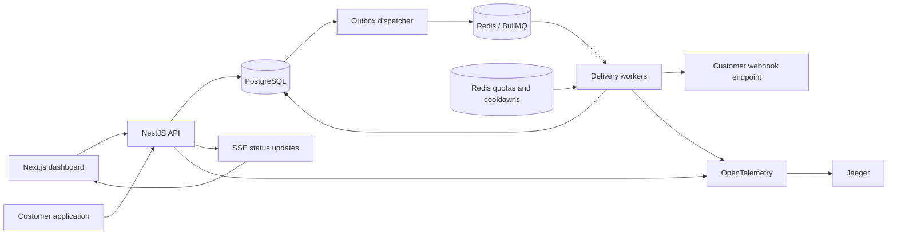

# Architecture and guarantees

## Atomic acceptance

The API transaction inserts an event, one delivery for each currently enabled matching endpoint, outbox entries, and an audit record. No Redis operation is part of that transaction. A transaction-scoped advisory lock and the unique organization/idempotency-key constraint handle concurrent duplicate submissions. Requests with the same key but different content are rejected. Retention takes the same advisory lock before replacing an event with a minimal receipt, so cleanup cannot reopen its key for publication.

The API's authentication/rate-limit checks fail closed when Redis is unavailable. An event already accepted stays durable in PostgreSQL while Redis is down. Ingestion does not promise availability throughout a Redis outage.

Endpoint routing is selected at acceptance. Workers read the current URL, signing secret, and enabled flag when executing an attempt. A disabled endpoint terminates pending delivery, rather than silently discarding it.

## Dispatch and recovery

The dispatcher takes a transaction-scoped advisory lock for admission, then chooses the least recently served eligible tenant and one due outbox row per turn using `FOR UPDATE SKIP LOCKED`. It admits at most three incomplete queued/executing jobs per tenant and fifty globally by default. Persistent service timestamps interleave tenants across sweeps; row locks protect selected work. HTTP workers run independently of the admission lock.

An outbox UUID is the BullMQ job ID. Enqueue happens before setting `dispatchedAt`. A Redis acknowledgement followed by a failed DB commit leaves the outbox eligible again; job-ID deduplication reduces duplicate queue entries.

Every 10 seconds, the reconciler finds overdue non-terminal deliveries with no live lease or recent/pending outbox entry. It creates a fresh outbox record. This also recovers a Redis job lost after the DB acknowledged dispatch. Reconciliation can enqueue redundant work under a long backlog; worker claims make these no-ops when another worker owns the delivery.

## Worker claims and fencing

Workers atomically claim a due delivery with its generation, an expiring lease, and a random lease token. Another worker cannot ordinarily claim the same live lease. Every update after an outbound request requires the same generation and lease token, so a stale worker cannot overwrite a newer worker's result.

An external receiver may still observe duplicates if a lease expires, a response is lost, or the database is unavailable after a successful request. Lease fencing protects local state, not external HTTP effects. Receivers must implement durable deduplication.

HTTP attempt history, scheduling-capacity release (`Outbox.completedAt`), and rescheduling/outbox insertion commit together. Reconciliation releases abandoned capacity. Paused circuit deliveries participate in recovery and backlog metrics. Durable bulk replay increments generations in bounded transactions and preserves attempt history.

Tenant quota deferrals do not increment HTTP attempt counts. A 429 increments HTTP attempts but not counted failures. Replays increment generation, reset retry age/budget, retain historical attempts, and make old generation jobs harmless. Only terminal deliveries can be replayed.

## Quotas and fairness

Redis Lua token buckets use Redis server time and execute refill/check/spend atomically. API limits are 30 requests/second with burst capacity 60 per workspace. Default delivery quota is 10/second per tenant. Redis sorted-set slots bound active outbound HTTP requests to three per tenant; slot expiry recovers a crashed worker.

Round-robin dispatch keeps most backlog in PostgreSQL and bounds how much any tenant can put in the shared FIFO queue. This provides equal turns and bounded admission, not weighted service or a latency SLA. Slow HTTP requests still occupy slots; large deployments may need scheduler partitions. The dispatch-delay histogram measures time past outbox due time, while per-tenant latency measurements remain a future extension.

See [delivery operations](delivery-operations.md) for circuit admission/probe fencing, replay-batch snapshots, and scheduler configuration.

## Security

- Passwords use salted scrypt; sessions and API keys store token hashes. Session cookies are HTTP-only and become secure in production.
- Browser mutations validate `Origin`, with a configured CORS origin and SameSite cookies. API keys carry explicit scopes, optional publishing/test event-type restrictions, expiry, and workspace binding. Existing keys default to publishing only; administrative routes require a browser owner session.
- All management queries check tenant ownership. Invitations bind to the invited email and expire after seven days.
- Signing secrets are encrypted using AES-256-GCM and an environment-supplied key; rotation keeps the previous secret for 24 hours.
- Destination validation rejects private, loopback, link-local, mapped-private, and reserved IPs. Every attempt resolves and validates DNS again and pins a validated address into the HTTP connection, limiting DNS-rebinding attacks. Redirects are never followed.
- Production requires HTTPS destinations and rejects development host allowlists. Response previews are bounded to 2,000 characters; responses exceeding 64 KiB abort. Payloads are capped at 256 KiB.
- A production network should additionally enforce outbound restrictions; application-level validation is one layer of defense.

## Observability

Events store their inbound trace context. A worker extracts that context and starts a delivery span, allowing HTTP client/database spans to correlate with ingestion in Jaeger. Structured logs carry event and delivery IDs and redact authentication headers/cookies.

Prometheus collects attempt outcomes, HTTP duration histograms, process metrics, backlog size, oldest outstanding-delivery age, and alert transitions. Grafana provisions an operations dashboard. The product dashboard exposes tenant-scoped DB statistics for production events, while infrastructure metrics count all delivery traffic and remain on the internal deployment network.

## Workspace maintenance

The dispatcher evaluates up to twenty due alert rules and cleans up to five due workspaces every ten seconds. Rule row locks serialize incident creation and transitions; a unique active incident key provides an additional duplicate guard. Optional opening/recovery notifications commit with the incident as ordinary outbox work, tagged `source=alert`. Alert evaluation excludes those notifications and test events.

Retention is opt-in. Workspace advisory locks prevent overlapping cleanup, and event/delivery row locks with `SKIP LOCKED` protect delivery claims and replay operations. Terminal completion time controls eligibility, so an old event replayed recently is retained. Event deletion cascades its delivery history, but replay items retain their original delivery ID and show an expired outcome. Retention receipts contain identifiers and a request hash, never the event payload.

Explicit test events target one endpoint, bypass its subscriptions, and store the signed headers and exact body alongside attempt diagnostics. Production attempts avoid that extra storage. Testing uses the same outbound engine and therefore affects receiver health, circuit state, and delivery quotas. See [workspace operations](workspace-operations.md) for the policies and API routes.
